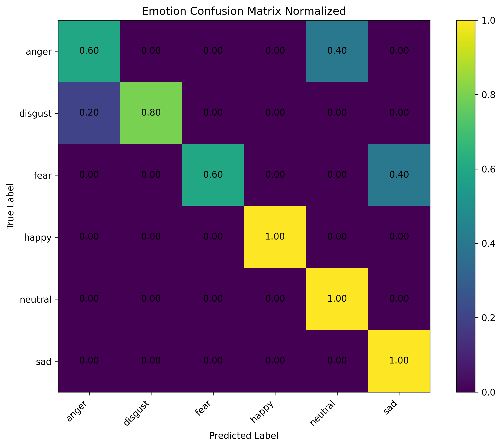
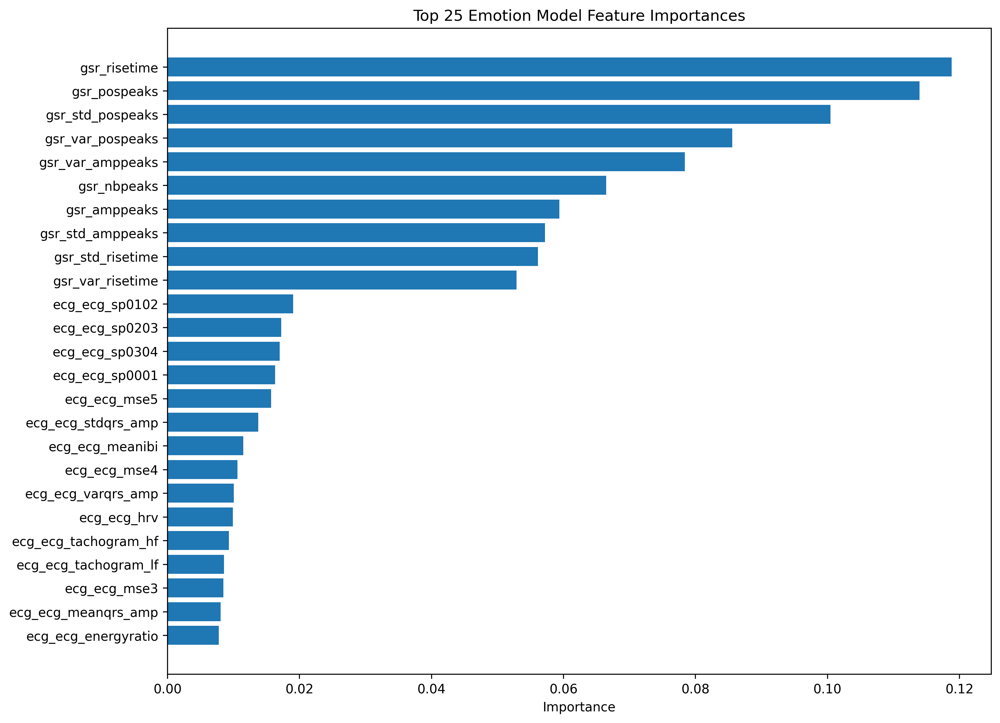
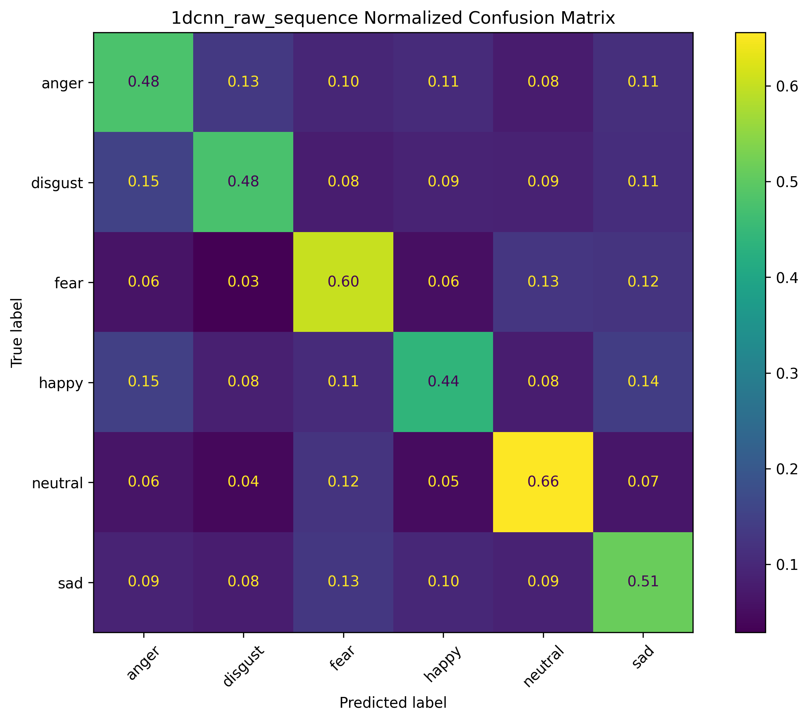
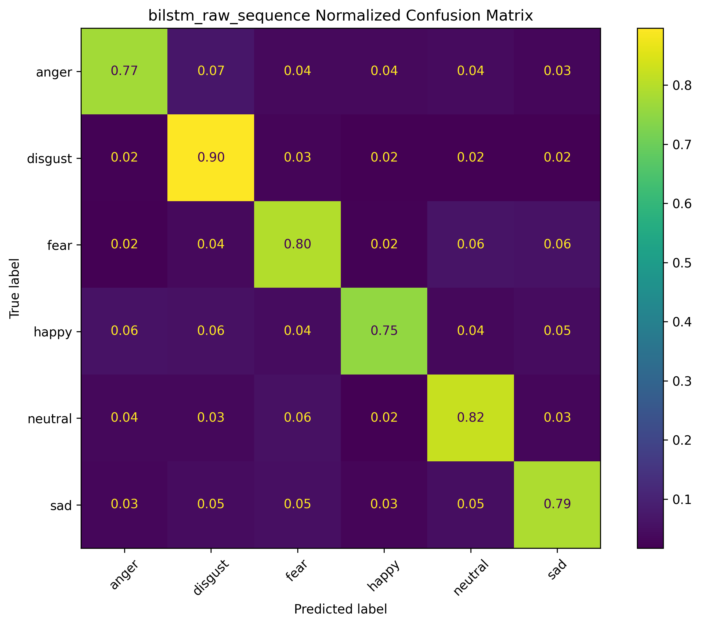
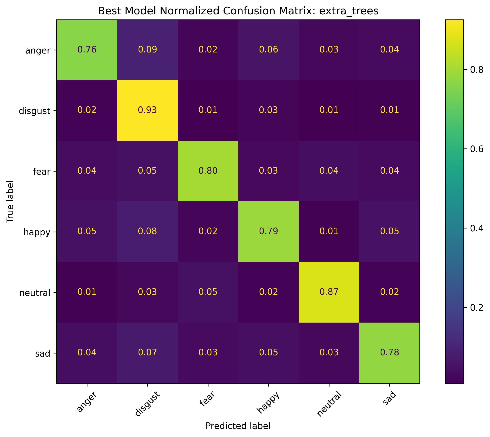

# Chapter 4: Discussion and Analysis of Results

This chapter breaks down the performance of the machine learning models trained on the two primary datasets. The evaluation relies on standard classification metrics, including precision, recall, F1-scores, and normalized confusion matrices, to understand how well the algorithms map physiological signals to discrete emotional states. 

---

## 4.1 Evaluation of the ECG and GSR Dataset

For the combined Electrocardiogram (ECG) and Galvanic Skin Response (GSR) dataset, an Extra Trees classifier was trained using 30 extracted physiological features. 

### 4.1.1 Extra Trees Classifier Performance
The model achieved an overall test accuracy of 83.33%. The classification report below highlights the precision, recall, and F1-scores across all six emotion categories.

```text
              precision    recall  f1-score   support

       anger     0.7500    0.6000    0.6667         5
     disgust     1.0000    0.8000    0.8889         5
        fear     1.0000    0.6000    0.7500         5
       happy     1.0000    1.0000    1.0000         5
     neutral     0.7143    1.0000    0.8333         5
         sad     0.7143    1.0000    0.8333         5

    accuracy                         0.8333        30
   macro avg     0.8631    0.8333    0.8287        30
weighted avg     0.8631    0.8333    0.8287        30
```

The model demonstrates excellent recognition of the "Happy" state, capturing a perfect F1-score of 1.00. The physiological markers for positive arousal were distinctly separable from negative states. However, there is slightly lower recall for "Anger" (60%) and "Fear" (60%). This overlap is physiologically expected; both fear and anger trigger intense sympathetic nervous system responses—such as increased heart rate and sudden peaks in skin conductance—making them challenging to differentiate purely from autonomic signals.

### 4.1.2 Confusion Matrix and Feature Importance


*Figure 4.1: Normalized confusion matrix for the ECG and GSR Extra Trees model.*

By analyzing the relative importance of the 30 features, we can observe which specific biological signals the algorithm relied on to separate the classes.


*Figure 4.2: Feature importance weights derived from the Extra Trees training.*

---

## 4.2 Evaluation of the ECSMP Dataset (HR and IBI)

Because the ECSMP dataset relies strictly on Heart Rate (HR) and Inter-Beat Interval (IBI) signals, extracting deep emotional context is more complex than when using full ECG waveform data. To find the optimal approach, five distinct architectures were evaluated: two deep learning sequence models (1D-CNN and BiLSTM) and three classical tree-based models (Histogram Gradient Boosting, Random Forest, and Extra Trees). 

### 4.2.1 Deep Learning Sequence Models

#### 1D Convolutional Neural Network (1D-CNN)
The 1D-CNN was tested to see if spatial convolution could identify emotional patterns directly from raw physiological sequences. It yielded a lower accuracy of 52.76%. 

```text
              precision    recall  f1-score   support
       anger     0.4789    0.4786    0.4787      1563
     disgust     0.5688    0.4759    0.5183      1580
        fear     0.5278    0.6030    0.5629      1559
       happy     0.5243    0.4401    0.4785      1570
     neutral     0.5893    0.6559    0.6208      1575
         sad     0.4782    0.5122    0.4946      1560

    accuracy                         0.5276      9407
```


*Figure 4.3: Confusion matrix for the 1D-CNN model.*

#### Bidirectional Long Short-Term Memory (BiLSTM)
The BiLSTM network performed significantly better, reaching an accuracy of 80.47%. Because emotions develop over time, the recurrent nature of the LSTM effectively captured the temporal dynamics of the heart rate variability changes.

```text
              precision    recall  f1-score   support
       anger     0.8176    0.7742    0.7953      1563
     disgust     0.7854    0.8962    0.8371      1580
        fear     0.7813    0.7954    0.7883      1559
       happy     0.8523    0.7535    0.7999      1570
     neutral     0.7958    0.8216    0.8085      1575
         sad     0.8056    0.7865    0.7960      1560

    accuracy                         0.8047      9407
```


*Figure 4.4: Confusion matrix for the BiLSTM sequence model.*

### 4.2.2 Classical Tree-Based Models

Following the deep learning tests, extensive feature extraction (yielding 243 statistical and HRV-based features) was performed to train three classical algorithms.

#### Histogram Gradient Boosting
This model achieved an accuracy of 79.80%, showing strong capability in identifying the "Neutral" state (89% precision).

```text
              precision    recall  f1-score   support
       anger     0.7880    0.7562    0.7718      1563
     disgust     0.7604    0.8797    0.8157      1580
        fear     0.8111    0.7877    0.7992      1559
       happy     0.7577    0.7650    0.7613      1570
     neutral     0.8938    0.8444    0.8684      1575
         sad     0.7882    0.7538    0.7706      1560

    accuracy                         0.7980      9407
```

#### Random Forest
The standard Random Forest classifier improved the results to 81.48%. By utilizing bagging across many decision trees, it managed the high-dimensional feature space without heavily overfitting.

```text
              precision    recall  f1-score   support
       anger     0.7999    0.7748    0.7871      1563
     disgust     0.7765    0.8994    0.8334      1580
        fear     0.8385    0.7960    0.8167      1559
       happy     0.7937    0.7841    0.7888      1570
     neutral     0.8694    0.8622    0.8658      1575
         sad     0.8184    0.7712    0.7941      1560

    accuracy                         0.8148      9407
```

#### Extra Trees (Best Performing Model)
The Extra Trees (Extremely Randomized Trees) algorithm achieved the highest overall accuracy on the ECSMP dataset at **82.15%**. 

```text
              precision    recall  f1-score   support
       anger     0.8246    0.7639    0.7931      1563
     disgust     0.7440    0.9253    0.8248      1580
        fear     0.8497    0.8012    0.8247      1559
       happy     0.8184    0.7866    0.8022      1570
     neutral     0.8820    0.8730    0.8775      1575
         sad     0.8331    0.7776    0.8044      1560

    accuracy                         0.8215      9407
```


*Figure 4.5: Confusion matrix for the Extra Trees model, highlighting balanced performance across all emotional states.*

---

# Chapter 5: Conclusion 

This research highlights the viability of interpreting emotional states directly from autonomic nervous system responses, avoiding the inherent biases of subjective self-reporting. 

For the combined ECG and GSR dataset, the Extra Trees model proved highly effective. Reaching an accuracy of 83.33% with only 30 extracted features, the results confirm that electrodermal and cardiac electrical signals contain dense, distinct physiological markers corresponding to emotional valence and arousal.

For the ECSMP dataset, extracting emotions solely from Heart Rate and Inter-Beat Intervals posed a more complex challenge due to the lack of complete waveform data. After evaluating five different architectures, the **Extra Trees classifier emerged as the best-performing model** (82.15% accuracy), outperforming both deep learning sequence models (1D-CNN, BiLSTM) and other classical tree-based methods (Gradient Boosting, Random Forest). 

The superiority of the Extra Trees algorithm in this context is likely due to the highly randomized nature of its node splitting. By forcing random thresholds during tree construction, it maintained lower variance than standard Random Forests when processing the 243 high-dimensional statistical and HRV features. Deep learning models like the 1D-CNN struggled to isolate spatial patterns in the raw physiological sequences, while the BiLSTM performed adequately but still fell short of the classical ensemble methods that utilized mathematically extracted HRV features.

Ultimately, both approaches successfully classified six distinct emotional states, demonstrating that physiological signals—whether captured via clinical ECG or accessible wearable heart rate sensors—can serve as a reliable foundation for objective emotion recognition.
